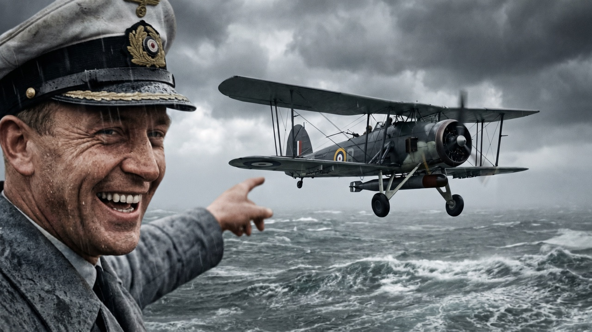
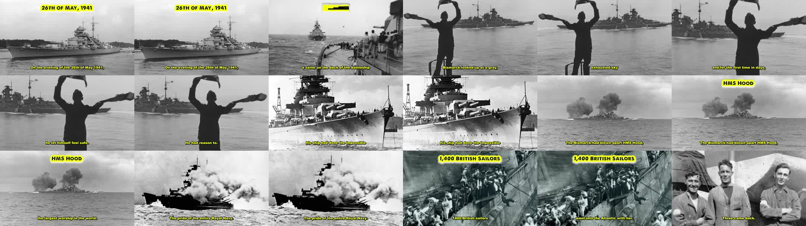
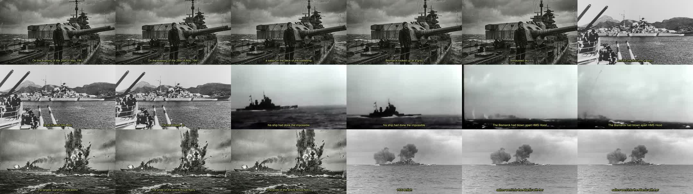
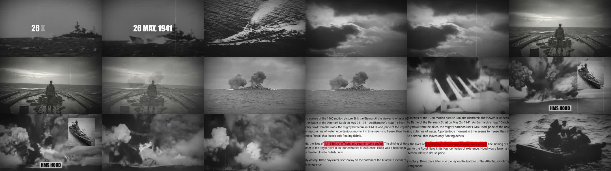

# Bridgehead - Dossier de délégation (Module 6)

**Vidéo V01 :** *"Germans Laughed at Britain's Antique Biplane - Until It Crippled Hitler's Greatest Battleship"* (Fairey Swordfish / Bismarck)

Préparé par Maxime, pour review mentor. Date : 27/06/2026.

> **Question centrale :** est-ce que ma méthode de sélection tient, et est-ce que je signe bien le bon monteur ?

---

## 1. Ce que je soumets

J'ai exécuté le Module 6 (système de délégation) pour la première vidéo de la chaîne. Je voudrais ta lecture avant de signer le monteur permanent. Ce dossier contient, dans l'ordre :

- Les 2 annonces Upwork postées (montage + miniature), template de la formation à la lettre.
- Le pool de candidats reçus (proposals), trié sur 4 critères.
- La barrière dure appliquée (90% JSS / 100$ gagnés / portfolio) et qui passe / qui sort.
- Ma shortlist de test.
- Le message de test envoyé (version finale, épurée).
- Les 3 rendus de test (liens Drive, visionnables) + mon évaluation et ma recommandation.
- 5 points que je veux te soumettre (dont 2 écarts assumés par rapport à la formation).

---

## 2. Le hybride Module 6 appliqué

Rôle = pilote stratégique : j'idée et je valide, je ne deviens pas monteur / voix / designer.

- **Script :** reverse-prompting (validé par le coach précédemment).
- **Voix off :** ElevenLabs (Daniel, modèle `eleven_v3`, preset Creative). Le hook généré sert d'asset au test des monteurs.
- **Montage :** délégué à un HUMAIN sur Upwork. La formation interdit le montage 100% IA (démonétisation / retrait du slop IA par YouTube). C'est le seul endroit où la méthode prime sur le réflexe "100% agentique".
- **Miniature :** produite en interne via IA (Higgsfield), style "école A" sans texte (scène cinématique colorisée). L'annonce Upwork miniature reste en réserve.

**Chaîne modèle (le concurrent à reproduire) :** [British War Archive](https://www.youtube.com/@britishwararchive/videos)
Style décodé : archives N&B authentiques, lents zooms Ken Burns sur photos, cuts secs, texte jaune sur les noms et dates clés, score sobre et grave.

**La miniature V01 (produite, école A, sans texte) :**



---

## 3. Annonce Upwork - Monteur (postée, template à la lettre)

Réglages : Long-term project / Expert / Fixed price / post gratuit.

```
Job Title: Video Editor Needed for WWII Military History YouTube Channel

Description:
I'm looking for an experienced video editor for my faceless YouTube channel.
Below are some details:
Payment: $25 per video
Frequency: 3 video edits per week

My competition channel is British War Archive (https://www.youtube.com/@britishwararchive/videos). You must be able to reproduce the style and quality of these edits.

Checklist:
- Did you include samples and previous work? (If not, don't apply)
- Do you have over 90% job success? (If not, don't apply)
- Have you earned more than $100 on Upwork? (If not, don't apply)

IMPORTANT: In your job proposal, please include multiple examples of your previous work. To make sure you read this job post thoroughly, please begin your proposal with your favorite fruit!

Thanks,
Maxime
```

---

## 4. Annonce Upwork - Miniature (en réserve, spec adaptée école A)

Note : le template dit "3-4 mots + boîte" (école B). Notre miniature validée est SANS TEXTE (école A). J'adapte cette seule ligne, je garde la structure.

```
Job Title: YouTube Thumbnail Designer Needed for WWII Military History Channel

Description:
I'm looking for an expert YouTube thumbnail designer for my faceless YouTube channel.
Below are some details:
Payment: $10 per thumbnail
Frequency: 3 thumbnails per week

My competition channel is British War Archive (https://www.youtube.com/@britishwararchive/videos). You must be able to reproduce the style and quality of these thumbnails. I DO NOT want classic, boring designs. I need thumbnails with:
- High contrast, highly readable on mobile devices
- A strong curiosity gap
- NO text on the thumbnail (the winning style on this channel is a colorized cinematic scene with zero text)

Checklist:
- Did you include samples and previous work? (If not, don't apply)
- Do you have over 90% job success? (If not, don't apply)
- Have you earned more than $100 on Upwork? (If not, don't apply)

IMPORTANT: In your job proposal, please include multiple examples of your previous YouTube thumbnails. To make sure you read this job post thoroughly, please begin your proposal with your favorite fruit!

Thanks,
Maxime
```

---

## 5. Pool de candidats reçus (proposals) + tri

Tri sur 4 critères : question piège du fruit / 90%+ JSS / track record / fit WWII-doc.

**Candidats retenus pour le test (top 6, passent tous la barrière + fit WWII/doc) :**

| Candidat | JSS | Track record | Signal fit | Fruit |
|---|---|---|---|---|
| **Imtiaz H.** (PK) | 100% | 29 jobs, 8K$+, 3 similaires | WWII-spécifique, "avoiding copyright issues, using real footage" | Apricot (humain) -> **#1 papier** |
| **Zeeshan N.** (PK) | 97% | 133 jobs, 1875h, 22 similaires | cite BWA + portfolio | Mango |
| **Tarikul I.** (BD) | 95% | 27 jobs, 285h, 2K$+ | "match the documentary-style of British War Archive" | Mango |
| **Taha A.** (PK) | 100% | 26 jobs, 4K$+ | military history + doc, 3 similaires | Mango |
| **Mohamed Nou.** (TN) | 100% | 13 jobs, 1K$+ | "archival footage, maps, sound design" = pile le brief | Mango |
| **Mohammad Usman** (PK) | 100% | 25 jobs, 10K$+ | vidéos d'armes / de guerres | Mango |

**Autres (2e tier ou recalés) :**

| Candidat | JSS | Note |
|---|---|---|
| Muhammad S. (PK) | 100% | 4 jobs, 4K$+, propose un sample 30s gratuit. 2e tier. |
| Tri Cao Lan N. (VN) | 100% | 6 jobs, 1K$+, propose un test gratuit, cite BWA. 2e tier. |
| Taha H. (PK) | 100% | 3 jobs, 400$. 2e tier. |
| Sami A. (PK) | 100% | 4 jobs, 100$ (plancher). 2e tier. |
| Faisal S. (PK) | 97% | 43 jobs, 373h. A lu (cite la chaîne) mais a zappé le fruit. |
| Rashid N. (PK) | **86%** | Cover EXCELLENT (a étudié BWA : pacing, cuts, color grade) mais **RECALÉ : JSS < 90%**. |
| Amna Allah R. (PK) | **50%** | OUT. |

---

## 6. La barrière dure (gate) appliquée

Critères binaires de la checklist : **90%+ JSS ET 100$+ gagnés ET portfolio**. En dessous = OUT, sans exception.

Cas limite assumé : Rashid N. a le meilleur cover du lot (il a clairement étudié la chaîne) mais 86% JSS. Je l'ai laissé OUT pour respecter la barrière. C'est le test qui doit trancher, pas la lettre de motivation, donc je ne repêche pas sous la barre.

---

## 7. Ma shortlist de test

J'ai envoyé le test aux candidats du haut. 3 ont accepté le test (Imtiaz, Zeeshan, Usman) ; au final 3 ont **livré** un rendu : **Tarikul, Zeeshan, Usman**.

À noter : Imtiaz (mon #1 sur le papier) a accepté mais n'a pas livré dans les temps ; Tarikul (top 6) a livré spontanément. Le test prime sur le profil papier.

---

## 8. Le test envoyé (message final, épuré)

Principe : test **gratuit** (la formation ne dit jamais de payer ; plusieurs candidats le proposent gratos d'eux-mêmes). Même message + même fichier audio (le hook ElevenLabs, [`assets/hook-daniel-v3-creative.mp3`](assets/hook-daniel-v3-creative.mp3)) pour les 3, donc comparaison à armes égales.

Choix volontaire : je **NE déroule PAS la recette de style**. Je pointe juste vers la chaîne de référence et je dis "match the style and quality". Si je liste la recette (archives, Ken Burns, cuts, texte jaune, score), je fais leur analyse à leur place, tout le monde converge, et le test ne révèle plus rien. Le but du test = voir qui étudie British War Archive et le reproduit seul. C'est aussi plus fidèle au template ("reproduce the style and quality of [competitor]", sans recette).

```
Great, thanks. Here's everything for the test.

Attached is the AI voiceover for the video's opening (the hook). Edit a 30 to 40 second sample from the start of it, sourcing your own archival footage (it's a WWII naval story).

Match the style and quality of British War Archive:
https://www.youtube.com/@britishwararchive/videos

Deliver the 30 to 40 second clip (mp4 or a link). Script below for reference. Whoever nails the style gets the ongoing contract.

---
On the evening of the 26th of May, 1941, a sailor on the deck of the battleship Bismarck looked up at a grey, exhausted sky, and for the first time in days, he let himself feel safe. He had reason to. Two days earlier, his ship had done the impossible. In under ten minutes, the Bismarck had blown apart HMS Hood, the largest warship in the world, the pride of the entire Royal Navy. Fourteen hundred British sailors went into the Atlantic with her. Three came back.
```

---

## 9. Les 3 rendus de test reçus (visionnables)

Les 3 ont monté le même hook de 30-40s à partir du même audio. Durées : Tarikul 36s, Zeeshan 43s, Usman 36s. Tous en 1920x1080.

| Monteur | Lien vidéo |
|---|---|
| **Tarikul Islam** | https://drive.google.com/file/d/1JAl5IAjF3F8Ed0VVR21j9dac9fHYzkyi/view |
| **Zeeshan Nawaz** | https://drive.google.com/file/d/1nK-ZMYmt5UjrMFY6gDXt1kGp4jZ9s4vD/view |
| **Mohammad Usman** | https://drive.google.com/file/d/1t8GeTU2GO1P3NWxAvhh6AGaqWoZprTZk/view |

> Si un lien demande un accès : ces fichiers sont sur les Drive **des monteurs**, je ne peux pas les rendre publics à leur place.

---

## 10. Évaluation : visionnage complet (rythme, son, footage)

J'ai analysé les 3 fichiers en lecture réelle : détection des cuts (rythme), test de présence d'une nappe musicale (détection des silences), niveaux audio, et planches de contact denses (1 image / 2s) pour vérifier le footage image par image.

**Note la plus importante :** le test renverse le classement papier. Tarikul, classé #3 sur le profil, sort en tête sur le rendu. C'est exactement pour ça que c'est le test qui décide.

### Signaux objectifs

| | Rythme (plan moyen) | Musique | Footage |
|---|---|---|---|
| **Tarikul** | 7 cuts / 36s = **4,6s** (posé) | **Aucune** (14 silences = voix off seule) | **Archive authentique** de bout en bout |
| **Zeeshan** | 9 cuts / 43s = **4,3s** (posé) | Score ajouté (0 silence) | Archive réelle, filtre lourd |
| **Usman** | 4 cuts / 36s = **7,3s** (très lent) | Score, **mais audio saturé (pic 0.0 dB)** | IA + film "Sink the Bismarck!" (1960) |

Aucun des trois ne fait du montage frénétique ; le rythme ne disqualifie personne. La chaîne BWA utilise bien un score sobre : Tarikul a délibérément choisi de ne pas en mettre (lecture défendable, seul axe où il est en dessous, trivialement corrigeable).

### Footage, vérifié image par image (planches denses)

**Tarikul** - archive N&B authentique du début à la fin (vrai Bismarck, marins qui saluent, vrai HMS Hood qui tire et explose, vrai plan final de 3 marins sur "Three came back"). Encadrés jaunes sur les noms/dates ("26TH OF MAY 1941", "HMS HOOD", "1,400 BRITISH SAILORS") = signature BWA, plus des sous-titres jaunes propres. Le plus fidèle, sans ambiguïté.



**Zeeshan** - correction de ma 1re passe. En lecture dense, son footage est en fait **majoritairement de l'archive authentique** (Bismarck en fjord, Hood qui explose, marins), juste avec un grain / vignette / rayures lourds. Je l'avais cru "IA" sur une planche 3x3, c'était une surinterprétation. Son vrai écart vs Tarikul : sous-titres jaunes **fins**, sans les encadrés gras sur les noms-clés, et un filtre plus appuyé.



**Usman** - confirmation du problème. Beaucoup de plans clairement **générés par IA / rendus 3D** (le marin face au coucher de soleil). Et surtout : un gros **bloc de texte d'article collé à l'écran** en fin de clip qui révèle sa source : le film hollywoodien *"Sink the Bismarck!" (1960)*, pas de l'archive (souci d'authenticité ET de droits). Texte blanc, date cassée "26 X", incrustation PiP.



---

## Recommandation finale : engager Tarikul Islam

Le visionnage complet confirme et renforce la 1re passe. Sur les 2 axes qui **définissent** British War Archive (archive authentique + texte jaune sur les noms), Tarikul est le seul pleinement fidèle, et il l'a trouvé tout seul (je n'ai pas donné la recette). Son rythme est bon (4,6s) et il a matché la sobriété de la réf. Le seul reproche (pas de musique) est mineur et corrigeable en un message.

- **Zeeshan** = solide #2 (archive réelle + bon grade + score), mais sans la signature texte jaune. Backup crédible.
- **Usman** = #3, footage IA + film de 1960 + bloc de texte collé + erreurs techniques. Écarté.

Profil papier #1 = Imtiaz (qui n'a pas livré). Le test a tranché autrement, et c'est le but : on signe sur le rendu, pas sur le CV. Tarikul (95% JSS, 27 jobs, 2K$+) passe la barrière dure.

---

## 11. Points que je veux te soumettre

1. **La question piège du fruit est décrochée en 2026.** Presque tous les sérieux ouvrent par "Mango" : c'est le signe que la proposal a été passée à une IA qui obéit et répond Mango par défaut, pas un filtre de lecture. Le fruit varié (Apricot d'Imtiaz, Lemon de Rashid) est un léger signal humain. Je garde la ligne (gratuit) mais je ne trie plus dessus. Tu la remplaces par un autre contrôle de lecture, ou tu la gardes telle quelle ?
2. **Le test "monte-moi 30s du hook" est mon extension.** Verbatim, la formation décrit le test SCRIPT (Le Script, [10:38] : un intro de 100 mots comparée à l'outlier). J'ai transposé le principe "on fait toujours un test" au montage. Est-ce que cette transposition te va comme méthode de sélection d'un monteur ?
3. **Pondération test vs profil papier :** Imtiaz était mon #1 papier (WWII, copyright, 8K$, fruit Apricot) mais n'a pas livré ; Tarikul, #3 papier, a livré le meilleur rendu. Je signe sur le test. Tu confirmes l'arbitrage ?
4. **"Altered content" :** à l'upload, YouTube demande si le contenu est "altéré / synthétique". On a des archives colorisées (miniature) et le coach a dit de répondre "non". Je veux confirmer avant publication, c'est un point policy sensible.
5. **Pricing :** 25$/vidéo (montage) + 10$/miniature, à 3 par semaine. Je compte demander une remise de volume. Les tarifs et la logique de remise te semblent bons pour cette niche ?

---

## 12. Assets liés (pour contexte)

- **Voix off :** ElevenLabs, voix Daniel (British, broadcaster posé), modèle `eleven_v3`, preset Creative. Le hook ([`assets/hook-daniel-v3-creative.mp3`](assets/hook-daniel-v3-creative.mp3)) a servi d'asset commun au test des 3 monteurs.
- **Miniature :** produite en interne via IA (Higgsfield), école A sans texte ([`assets/thumbnail-1280x720.jpg`](assets/thumbnail-1280x720.jpg)), 1280x720.
- **Script :** ~1900 mots, validé par le coach, avec hook de rétention à 30% et pivot à 50%.
- **Preuves de notation :** les planches denses sont dans [`assets/evidence/`](assets/evidence/).

Merci pour ta lecture.
Maxime
